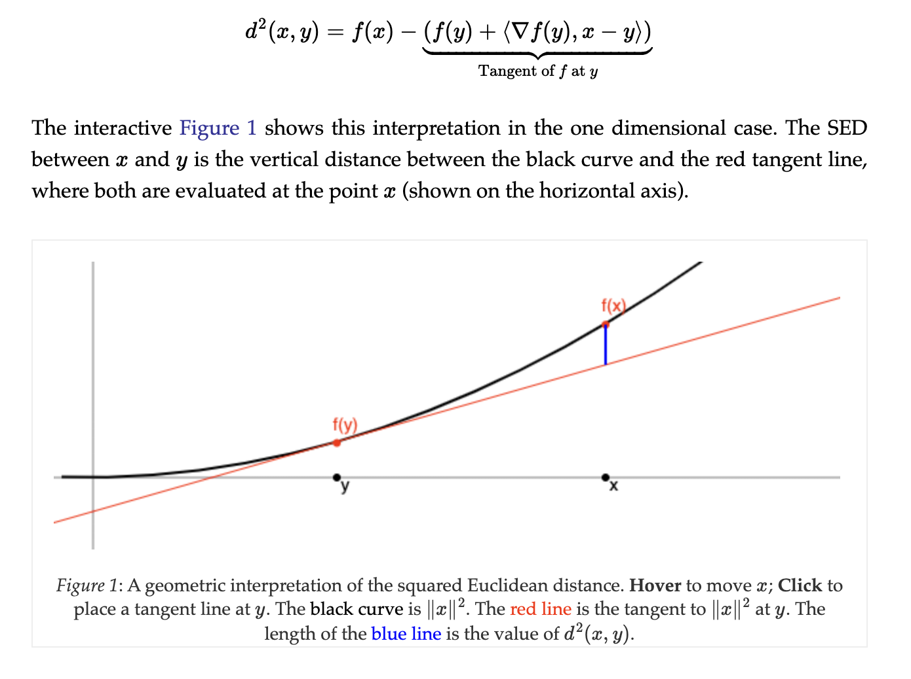

Random glossary

### Bregman Divergence

* d(x,y) : Difference between f(x) and the the tangent at y 

* any divergences where mean point always minimizes that divergence is some bregman divergence

* f has to be striclty convex s.t. divergence is always positive

[more information](http://mark.reid.name/blog/meet-the-bregman-divergences.html)

### f-divergence

Generalization of KL divergence for comparing different distributions $D_{f}(P \| Q) := \int_{\Omega} f\left(\frac{d P}{d Q}\right) d Q$

Cool facts:
* all f-divergence approximate KL up to second order

## Inequalities

* Stirling: 
  * $\ln n !=n \ln n-n+O(\ln n)$
  * $\log \left(\begin{array}{c} N \\ r \end{array}\right) \simeq N * \mathrm{H}[\frac{r}{N}]$

## Tricks

* if want rounding can take advantage of $\lfloor X - U \rfloor + U \sim X + U$ where $U \sim Unif(-0.5,0.5)$ (universal quantization)