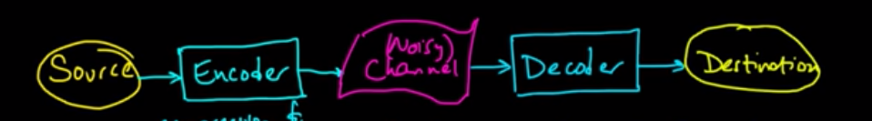
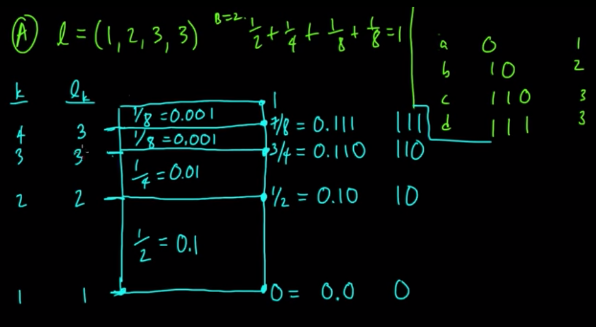
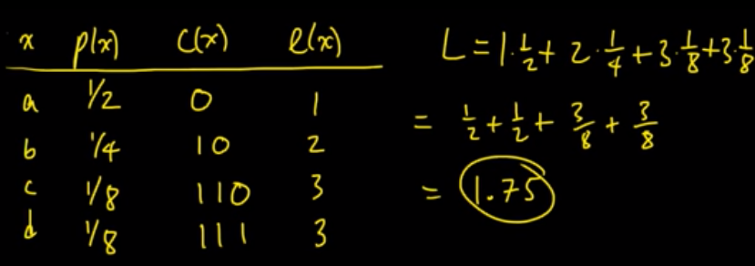
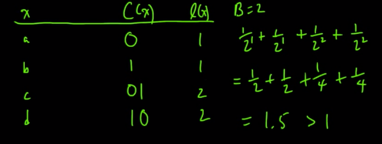
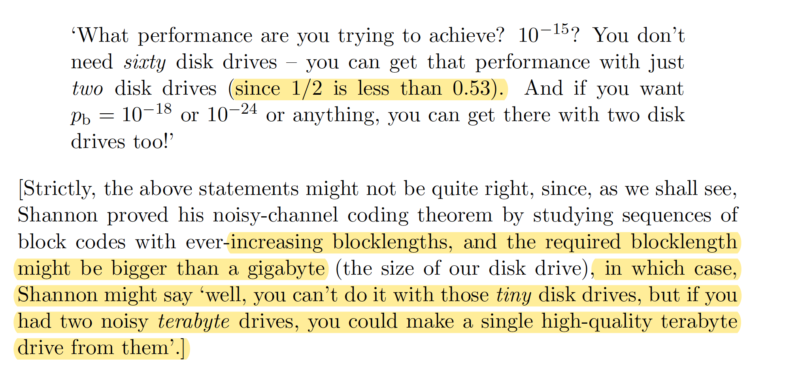

- [Information Theory](#information-theory)
  - [Source Channel Separation](#source-channel-separation)
  - [Information](#information)
  - [Symbol Codes / Variables length codes](#symbol-codes--variables-length-codes)
    - [Definitions](#definitions)
    - [Desired Properties](#desired-properties)
    - [Theory](#theory)
      - [Krafts-Mcmillian Inequality](#krafts-mcmillian-inequality)
      - [Entropy as a lower bound on expected length](#entropy-as-a-lower-bound-on-expected-length)
      - [Block Code](#block-code)
        - [Source Coding Theorem](#source-coding-theorem)
    - [Examples](#examples)
  - [Todo](#todo)

# Information Theory

Central problem: efficient and reliable transmission and storage of  information

History: claude shannon's in " A mathematical theory of communication"

Great resources: mathematical monk

Overview:

|                           |                            Compression   (=source coding / efficiency)                             |      Error-correction   (=channel coding / reliability)      |
| :------------------------ | :---------------------------------------------------------------------------------------------------: | :-------------------------------------------------------------: |
| Information Theory (math) | **Lossless**: Source coding theorem / Kraft-McMitta inequality      **Lossy**: Rate-distortion thm |     Noisy coding thm / CHannel Capacity / Typicallity & AEP     |
| Coding Theory (algorithm) |       **Symbol codes**: Huffman codes       **Stream codes**: Arithmetic coding / Lempel-Ziv       | Hamming codes / BCH codes / turbocodes codes   / Gallager Codes |

Related: Cryptography, algorithmic information theory, statistics and ML, network information theory

Application: 3G,4G, Nasa, storing on CD even if scratch, RAM, bar code

## Source Channel Separation
General problem is to have efficient and reliable communication. 
The channel is usually channel (e.g. because transmission goes through some physical things => noisy)

Assumption: forward error correction (decoder cannot ask the encoder to resend some information, e.g., when live / online)

**Source-Chanel separation Theorem**: You can do optimal compression and error correction by decoupling the problem into source and channel coding [Shannon]. General assumptions (asymptotic equipartion property)

NB: not talking about computation complexity => by combining both could have equivalent but less computational complexity

## Information

Here information has nothing to do with meaningful information / utility but only through communication / transmission  + only through random variables

When we'll talk about lossy compression we'll incorporate utility by incorporating a distortion function => minimal amount of information you need to keep at least X of information as given by a distortion function

## Symbol Codes / Variables length codes

Application: morse code (give shorter code to more frequent english letters)

History: Morse and Veil. And morse who was a painter did that because his wife died and he wasn't able to see her because message came too late => dedicated his life to change that in the future

Discrete Memoryless source:
- Source: sequence of rvs 
- Memoryless: iid (e.g. letters in english are modeled as iid to give code)
- discrete: each rv is countable
- Alphabet: 
  - Source alpphabet $\mathcal{X}$ (e.g. letters)
  - Code alphabet $\mathcal{A}$ (e.g. binary)
- Kleene star: $A^*$ all possible sequences of any lenth using alphabet A

### Definitions
* **Symbol Code**:  
  A function $C: \mathcal{X} \to \mapsto{A}^*
* **Extension of C**:  
  $C^*: \mathcal{X}^* \to \mathcal{A}^*$ by homorphic extension, i.e.,  $C(x_1 \dots x_n) := C(x_1) \dots C(x_n)$
* **Codewords of C**:  
  All the image of $\mathcal{A}^*$ by C
* **Prefix Code** (= prefix free, instantaneous)  
  If no codeword is a prefix of another codeword, i.e., if represented as tree no internal node is a codeword)
* **Right-Prefix Code** (= prefix free, instantaneous)  
  if when reverse the codes is a prefix code
* **Length of code**  
  $l(x) \mapsto |C(x)|$
* **Expected codeword length**
  $L=\sum_{x \in mathcal{X}} l(x)p(x) = E_X[l(X)]$ expected of length of codeswords, i.e. letters
* **B-ary code**  
  Is a code s.t. $|\mathcal{A}| = B$, e.g. $\mathcal{A}=\{0,1\}$ is binary 

### Desired Properties
* **Uniqely decodable C**  
  If $C^*$ is always a bijections => can recover the original sequence
* Efficiency in compression (small expected length)
* Speed at decoding (encoding is always simle: lookup table)
* Simple coding

### Theory

* Prefix => uniquely decodable (not <=)
* Right-prefix => uniquely decodable
* Prefix code => linear time decoding because simply follow the tree

#### Krafts-Mcmillian Inequality

**Theorem**  
$\exists$ uniquely decodable B-ary code C with codeword length $l_1,\dots,l_n$ iff
$\sum_{x \in \mathcal{ X}} \frac{1}{B^{l(x)}} \leq 1$.
Furthermore, there always exist a prefix code with that property

**Implications**
* Justifies why we only care about prefixcodes: any set of length achieved by uniquely decodable codes can always be achieved by prefix code
  
**Intuition**
* There's only so many short codes that can be used. Small code words are more "expensive" as eats more budget $B^{-l(x)}$ is larger. This inequality formalizes exactly this budget.

**Proof idea**
* Krafts inequality, i.e., can reach the inequality with a prefix code:  
  Use an algorithm to do so (could also prove by counting the number of prefix-free codes at every step [like here](https://mortada.net/simple-proof-for-krafts-inequality.html) or [here](https://en.wikipedia.org/wiki/Kraft%E2%80%93McMillan_inequality#Proof_for_prefix_codes)):
  1. Order all the lengths $l_1, \dots, l_n$
  2. Assign to every length a value $B^{-l_i}$ 
  3. Compute the cumulative sum of these values
  4. Represent it in B-ary expansion
  5. Add to every B-ary expansion a number of 0 such that there's as many decimals as the length you wanted

This will always give a prefix code with correct  lengths. Correct lengths by construction. ALways prefix because it happens that for a B-ary decimal to be a prefix of an other the difference between both has to be less than $B^{-l}$ (e.g. c=0.001 is a prefix of all numbers that are $< c + 10^{-3}$) which is exactly what you are adding ! => making sure numbers that have other numbers as prefix code are not used (and it's tight!). 

* McMillian inequality, i.e., unique decodability iff bound is satisfied. 
  1. Already proved that can always construct prefix code (stronger than unique decodable) so only need to show that unique decodability $\implies$ inequality
  2. Let $r=\sum_{x \in \mathcal{ X}} B^{-l(x)}$, proof idea is to upper bound $r^k$ for $k \in \mathbb{N}$ and show that can only hold $\forall k$ if $r \leq 1$. Let $l_{max}=\max_x l(x)$ denote the longest possible codeword. We get $r^k =  \sum_{s=0}^{k*l_{max}}  B^{- s}  \bigl| \{ x_1, \dots, x_k | \sum_{i=1}^k l(x_i)=s \} \bigr|$
  3. Bound the number of uniquely decodable sequences with a certain length $\bigl| \{ x_1, \dots, x_k | \sum_{i=1}^k l(x_i)=s \} \bigr| \leq B^s$ 
  4. Putting all together we get $r \leq (k*l_{max} + 1)^{\frac{1}{k}}$ $\forall k \in \mathbb{N}$. As the r.h.s. asymptotocally approaches 1, this can only hold if $r \leq 1$ as desired. Full derication:
   
$$
\begin{aligned}
r^k 
&= \left( \sum_{x \in \mathcal{ X}} B^{-l(x)} \right)^k \\
&= \sum_{x_1 \in \mathcal{ X}} \dots \sum_{x_k \in \mathcal{X}} \prod_{i=1}^k B^{-l(x_i)} & \text{distribute} \\
&= \sum_{x_1, \dots, x_k }  B^{- \sum_{i=1}^k l(x_i)} & \text{exponentials} \\
&= \sum_{s=0}^{k*l_{max}}  \sum_{\substack{x_1, \dots, x_k \\ s.t. \ \sum_{i=1}^k l(x_i)=s}}  B^{- s} & \text{sum same exponents} \\
&= \sum_{s=0}^{k*l_{max}}  B^{- s} \sum_{\substack{x_1, \dots, x_k \\ s.t. \ \sum_{i=1}^k l(x_i)=s}}  1 \\
&= \sum_{s=0}^{k*l_{max}}  B^{- s}  \bigl| \{ x_1, \dots, x_k | \sum_{i=1}^k l(x_i)=s \} \bigr| \\
&\leq \sum_{s=0}^{k*l_{max}}  B^{- s}  B^{s} \\
&\leq \sum_{s=0}^{k*l_{max}}  1 \\
&\leq k*l_{max} + 1 \\
r &\leq (k*l_{max} + 1)^{\frac{1}{k}} 
\end{aligned}
$$

#### Entropy as a lower bound on expected length

* **Proof intuition**:

1. Longer (but more understadable) proof
We want to minimize the expected code length $L= \sum_{x \in \mathcal{X}} l(x)p(x)$ under constraint of Krafts-Maxmilian (because want unique decodability). For simiplicity start working with real valued lengths. Note that actually constraint is equality $\sum B^{-l_i} = 1$ (because if smaller than 1 could increase it a little by decreasing one of the lengths). Now let's do a change of variable $q_i = \frac{1}{B^{l_i}}$ i.e. $l_i = \log_B \frac{1}{q_i}$. Then the problem is:

$$\min_{\substack{q: q_i > 0 \\ s.t. \ \sum q_i = 1 }} \sum p_i \log_B \frac{1}{q_i} $$

Note that the function f(q) is strictly convex. While the $q_i$'s satisfying the constraint is a convex set (i.e. taking convex combination of $q_i$'s that satisfy the constraint, still satisfy). And as the restriction of a striclty convex function to a convex set is also stricly convex => can just use lagrange multipliers (local minimas) to find the global minima

So optimal expected length is entropy (or real valued length!! $\sum_i \log_B \frac{1}{p_i}$. Note that over integer length < real lengths (because more constraiend). SO actually entropy is lower bound $H \leq L$. But with integers you can simily take ceiling to have integers. ANd ceiling nevers adds 1 or more . SO for all lengths add less than 1, so expected addition is less than 1 so $H \leq L < H + 1$. Taking the ceiling is what is called *Shannon coding* (might not be optimal).

2. Shorter proof:

Using relative entropy

#### Block Code

The problem when coding every symbol with a specific code is that you can be arbitrary close to the upper limit $L < H + 1$, i.e., you can lose one bit per symbol so in sequence of n symbols, can lose n bits. The idea of block code is to "distribute" the inefficiency on multiple symbols (in a block) so that each block uses at max one additional bit rather than k.

##### Source Coding Theorem 

Note that everything we showed until now can be reused for blocks because can simply treat every block as a source symbol with a specific distribution and length. So what do we gain?

Well as before we have $\mathrm{H}(p^k) \leq ExpectedBlockLength < \mathrm{H}(p^k) + 1$ where $p^k$ is the joint distribution of k symbols. And because  we assumed that every symbol is i.i.d  we have $k * \mathrm{H}(p) \leq ExpectedBlockLength < k* \mathrm{H}(p) + 1$. So the expected length PER single symbol is $ \mathrm{H}(p) \leq L < \mathrm{H}(p) + \frac{1}{k}$. So can be arbitrarily close to lower bound in case you use large blocks.

### Examples
* Morse code:
  * $\mathcal{X} = \{A,\dots,X,0,\dots,9\}$ and $\mathcal{A}=\{0,a\}$
  * $C(h)=  0001$
  * $C^*(hello) = C(h)C(e)C(l)C(l)C(0) = 0010001111 \dots$
* Not uniquely decodable:
  * $C(a) \mapsto 0; C(b) \mapsto 1; C(c) \mapsto 01$ so cannot know if $01$ is the code for $ab$ or for $c$  
* Not prefix condition:
  * $C(a) \mapsto 101; C(b) \mapsto 00; C(c) \mapsto 0001, C(d) \mapsto 1$
  * not prefix code because C(c)=C(b)01 but still uniquely decodable
* Prefix condition but not left-prefix:
  * $C(a) \mapsto 0; C(b) \mapsto 10; C(c) \mapsto 110, C(d) \mapsto 111$
* Code which reaches optimal expexted length L

* Not uniquely decodable proof using Krafts-McMillan
  

## Todo

* Noisy-channel coding theorem: shannon proves that using noisy channels you could reach arbitrarily small probability of error with a fixed rate (although this is in the limit of sending infinite dat)

* Rate / Capacity : when trying to send a r.v. $Z$ generated from $p(z|x)$ the minimum rate needed is $\mathrm{I}[Z;X]$ because many $ Z$ actually come from the same $X$! So no need to perfectly reconstruct $ Z$ just need to reconstruct everything which is useful, i.e., $\mathrm{H}[ Z] - \mathrm{H}[Z | X]$ the rest is useless.

* If bob has access to a distribution $q(z)$ and alice wants him to sample form $p(z)$ (and they have access to same rng), all she needs is to send $KL[p(z)||q(z)]$. Note that this is smaller than $\mathrm{E}_{p(z)}[- \log q(z)]$ because she can take advantage that they have access to the same distribution. For example if $q=p$ then number of bits needed is $0$ !!

* The channel theorem essentially is a sphere packing problem: how many spheres can you maximally pack in a given space. I.e. is you have a given noisy channel $p(z|x)$ how can you maximize $p(x)$ to pack as many representations $z$ that correspond to a single $x$. You know that the number of typical sequences in $Z$ is $2^{nH[Z]}$ while the average number of sequences per $x$ is $2^{nH[Z|X]}$ so at most you can have $\frac{2^{nH[Z]}}{2^{nH[Z|X]}}=2^{nH[Z]-nH[Z|X]}=2^{nI[Z;X]}$ different $x$ that get mapped to $z$'s that are disjoint (i.e. low probability of error when reconstructing). As always that might not be achievable using a single r.v. but it is achievable a.s. as the number of variables that are being encoder together goes to $\infty$.

* The rate distortion theorem corresponds to a sphere covering problem: what is the minimum number of spheres that you need to cover a set. Here we assume that $X$ is given, and we are interested in finding the minimum number of $z$ that you need to recover some $x$ with a fixed distortion. The big difference with before is that we now assume $p(x)$ is given and trying to come up with the best channel while before we were wondering the best we could squeeze into a channel. We want to put the least $z$ to be able to still cover the sequences of $X$ modulo some distortion we are allowed. For example if we used only a single $z$ then many typical $x$'s would be mapped from the same $z$ so you would incure large distortion. THe number of sequences to cover is $2^{nH[X]}$ so under some distortion you try to maximize the number of sequqnces that get mapped from the same $z$, in average $2^{nH[X|Z]}$. I.e. you try to minimize $2^{nI[Z;X]}$ under constraint.
  