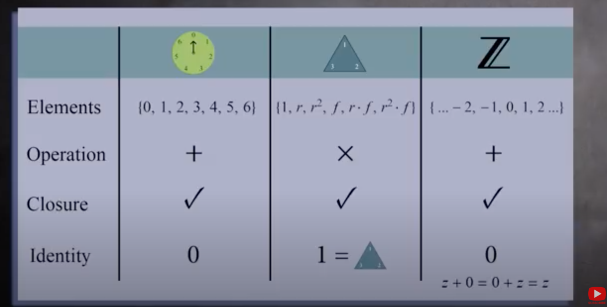
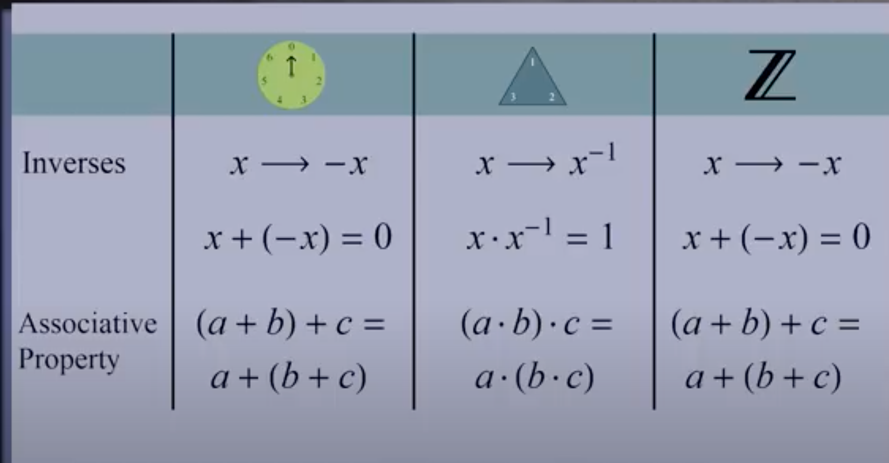
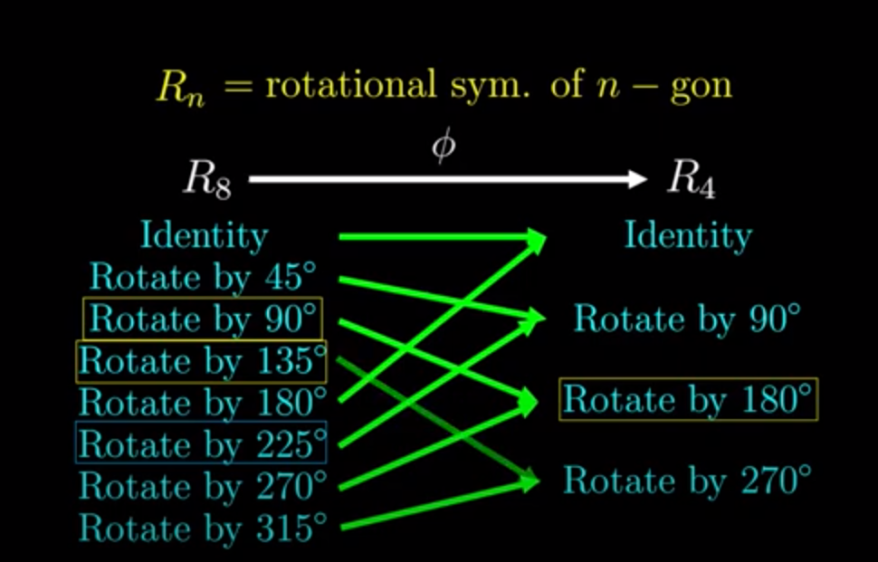
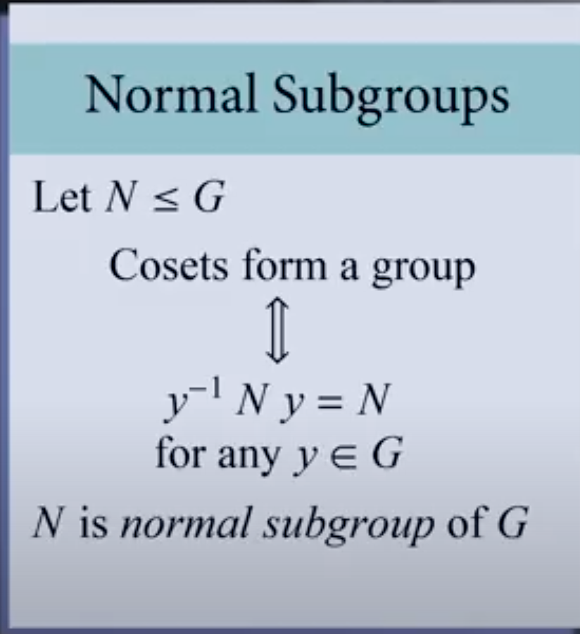
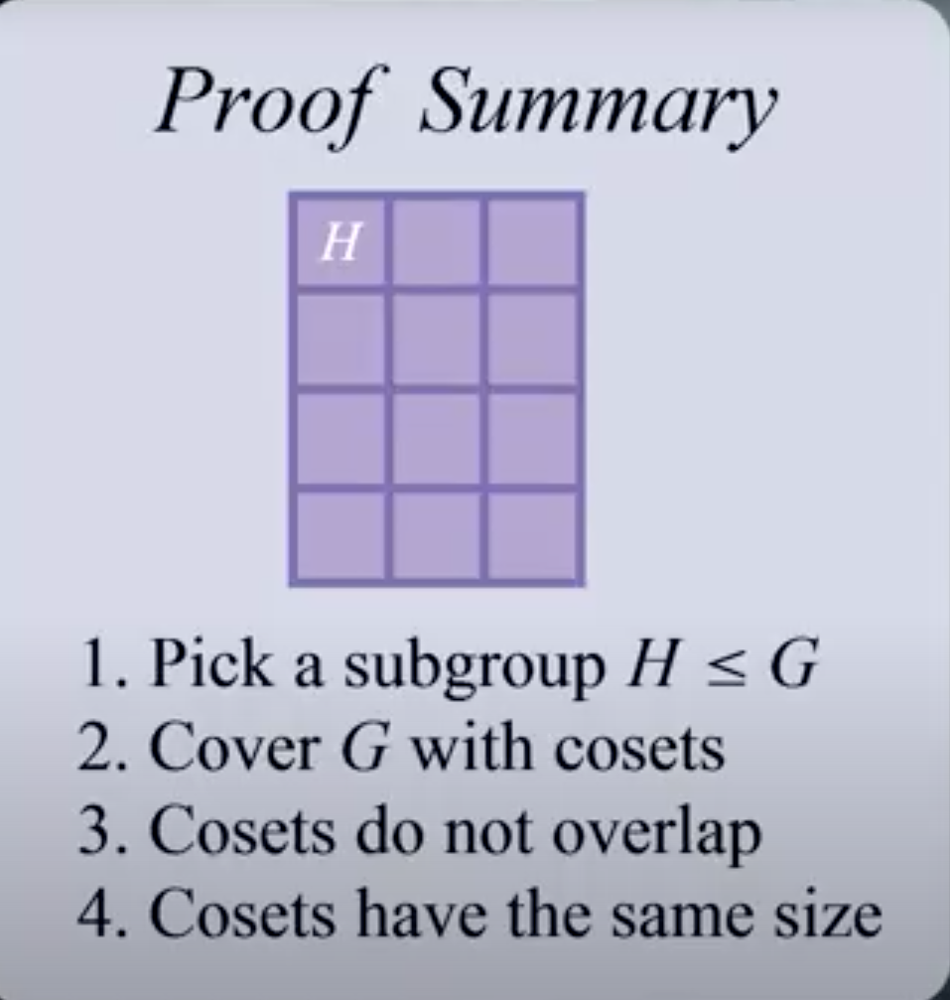

## Abstract algebra

History: Evarist Galois 

Bibliography: [socratica video](https://www.youtube.com/watch?v=g7L_r6zw4-c&list=PLi01XoE8jYoi3SgnnGorR_XOW3IcK-TP6&index=2), [3blue 1 brown](https://www.youtube.com/watch?v=mH0oCDa74tE), [methemaniac](https://www.youtube.com/watch?v=EsBn7G2yhB8&list=PLDcSwjT2BF_VuNbn8HiHZKKy59SgnIAeO)

### Groups

Disclaimer: here we  will focus on finite size groups

#### Example
* modular arithmetics
* rotation (120 degrees) and flipping of triangles (symmetries). THere are 6 possible ways of doing all of them and all are combinations of flipf f and rotations r
* integers under addition

#### Definition

Set of elements G with an operation (say *) s.t.
* **closed** under operation:
* $\forall x$ there exists an **identity** s.t. $y * e = e * y = y$
* $\forall x$ there exists an **inverse** s.t. $y*e = e*y =y$
* **Associativity**: $(a*b)*c = a*(b*c)$

This directly comes form what is a symmetry:
- a composition of 2 symmetries is a symmetry
- composition of symmetries is associative
- not doing anything is a symmetry
- we can undo symmetries

Other:
* abelian group: group with commutative operation
* order of a group: number of elements
* * Group Homomorphism: a function between two groups that preserves the group structures. i.e., a group homorphism from $(G,*)$ to $(H,\cdot)$ is function $f:G \to H$ s.t. $\forall u,v \in G, \ h(u * v) = h(u) \cdot h(v)$. Example the homorphism from $(\mathbb R, +)$ to $(\mathbb R^+, \times)$ is $f: x \mapsto e^x$ because $f(x+y) = e^{x+y} = e^{x} \times e^{y} = f(x) \times f(y)$. Other example: rotation of 8-gon is homorphic to rotation of 4-gon even if different number of symmetries:

* isomorphic groups: 2 groups are isomorphic if essentially equivalent with some renaming. Formally it is a bijective group homorphism. In other words if color coded cayley tables would be the same.for example $R_12$ is isomorphic to $\mathbb{Z} / 12 \mathbb{Z}$, where (one possible) isomorphism is rotate by $30$ degree $\mapsto k + 12 \mathbb Z$. 
* subgroup: a subset of a group that is a group itself written $H \leq G$
* trivial group: group with only element $\{e\}$
* Left coset: let H be subgroup of group G. the left xoset of H in G are the sets obtained by multiplying each element of H by a fixed element $g \in G$, i.e, $g H=\{g h: h \text { an element of } H\} \text { for each } g \text { in } G$
* index of a subgroup: the number of lest cosets of H in G (equiv right cosets) $|G:H|$. Example $2 \mathbb Z$ (even numbers) has two cosets in $\mathbb Z$ namely even integers (when adding 0) and odd (when adding 1). So $|\mathbb Z: 2 \mathbb Z|$ is 2 (more generally n if $|\mathbb Z: n \mathbb Z|$)
* group action: a group action of the group G on set X (for example edges of faces, or vertices for tetrahydra's) is a function $G \times X \to X$, s.t. *identity* $e*x = x, \forall x \in X$ and *compatibility* $(gh)*x = g *(h*x), \forall g,h \in G$
* orbit(x): set of all the places x can go to when mapped using the group action (e.g. orbit vertex 1 in triangle when rotating is all vertices because can always map it to an other vertex)
* stabilizer(x): set of all symmetries that fixes x (i.e. doesn't move it). Note that by definition the set always contains the identity
* congugation: we say that two elements $a,b \in G$ are conjugate if exists $g \in G$ s.t. $g a g^{-1}=b$. So essentially it's the same symmetry but from a different perspective!
* conjugacy class: equivalence class $\mathrm{Cl}(a)=\left\{g a g^{-1} \mid \mathrm{g} \in G\right\}$
* normal subgroup: a subgroup that is invariant under conjugation by members of the group of which it is part of, i.e., a subgroup $N$ of group $G$ is normal in $G$ iff $gng^{-1} \in N, \forall g \in G, \forall n \in N$. i.e., it is the same under any perspective (note that $gng^{-1}$ might not be $n$ as long as $\in N$). Example for modulo 5 the normal subgroup is $5 \mathbb Z$.
* Quotient group $G/N$ (also factor group): a group obtained by aggregating similar elements of a larger group (i.e. partitioning the larger group using an equivalence relation). For example arithmetic mod 5 all the congruence classes (i.e. remainder when dividing by 5) together form a group (the quotient group $\mathbb Z / \mathbb 5Z$) because adding a number with remainder 2 to a number with remainder 4 gives a number with remainder 1. Note that the quotient group is not a subgroup of G, it's completely different (it's not a group of symmetries but of set of symmetries) but it uses a subgroup, namely $5 \mathbb Z$, to define the group !
  

* simple subgroup: a subgroup whose only normal subgroups are the trivial group and itself. This is essentially the equivalent of prime numbers in number theory because they are the building blocks of larger groups but cannot themselves be decomposed.
* Subgroup generated by S (denoted $<S>$): smallest subgroup of G containing every element of the subgroup S. E.g. subgroup generated by a single element $x$, i.e. $<x>$, with multiplication operation is $\{ \dots x^{-n}, \dots x^{-1}, 1, x, \dots, x^{n}, \dots \}$ because need to contain x, the identity $1$, the inverse $x^{-1}$, but also needs to be closed so $x^{2}=x*x$ needs to be in the group, so inverse $x^{-2}$ also, $\dots$ Similarly for addition $<x>$ is $\{ \dots -nx, \dots -x, 0, x, \dots, nx, \dots \}$. 
* cyclic group: a group that can be generated by single element. Example: $\mathbb Z$ is an (infinite) cyclic group (because $\mathbb Z = <1>$ under addition). Example of finite cyclic group $<1>=\mathbb Z / n \mathbb{Z}$, note that now it cycles $\{\dots, 0,1,\dots, n-1, 0,1, \dots, n-1, \dots \}

#### Properties
Note:
* there only a single group of order 1,2,3
* every group has at least 2 subgroup: the trivial group and itself
* if at least one element is the same in two cosets then all the elements are the same
* in a quotient of a group the equivalence class of the identity element is always a normal subgroup of the original group and the other quivalence classes are the cosets of that group. Furthermore all normal subgroups can be used to defined a quotient group. E.g. mod 5 the identitiy element is $5 \mathbb Z$ which is a normal subgroup of $\mathbb Z$.

* all cyclic groups are (isomorphic to) $\mathbb Z$ (infinite case) or $\{e\}. \ \mathbb Z / 2 \mathbb Z, \ \mathbb Z / 3 \mathbb Z, \ \mathbb Z / 4 \mathbb Z, \dots$  

**Lagrange theorem**
$H \leq G \implies |H| divides |G|$ (specifically $|G|=[G: H]|H|$), i.e., subgroups cannot be of any size

**Orbit-stabilizer**
THe order of a group is the product of the orbit and stabilizer. $|G| = |orb_G(x)| * |stab_G(x)|, \forall x \in X$. 

Note: putting it with lagrange theorem we get that number of cosets of the stabilizer of x is size of the orbit of x (in the case of infinite size sets then the full theorem says that there's a bijection between stabilizer and number of cosets)

**The fundamental theorem of finitely generated abelian groups**
(?) any abelian group that is finitely generated can be broken apart into finite number of cyclic groups. So cyclic groups are the fundamental building blocks of finitely generated abelian groups. 